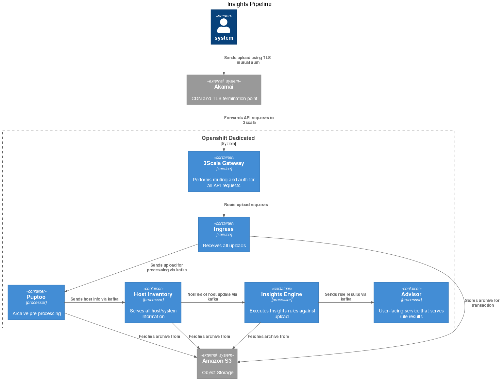

# Insights Advisor Backend

This is the Insights Advisor Backend repository. This repository
hosts both the Advisor API and the Advisor Service. This is the top-level README
for both services. To see more detailed information about the API or the
Service look at their respective READMEs in "api" or "service" directories.

# Installation

## Pre-requisites

```
python 3.12+
pipenv
podman and podman-compose
```

## Setup Python environment

Setup the Python environment:
```
pipenv shell
pipenv install
pipenv install --dev
```

## Database

To start the database, run required migrations and load required
fixtures you will need to run the following commands:
```
export ADVISOR_DB_HOST=localhost
podman-compose up -d advisor-db
pipenv shell
python api/advisor/manage.py migrate
python api/advisor/manage.py loaddata rulesets rule_categories system_types upload_sources basic_test_data
```

## Feature Flags

Feature flags are supported by Unleash. Connection to an Unleash server is done
by a Clowder provided config.

Local development can be done by supplying bootstrapped feature flags via
`UNLEASH_BOOTSTRAP_FILE` environment variable. `UNLEASH_BOOTSTRAP_FILE` should
point to a JSON file conforming to Unleash's [API
/api/client/features](https://docs.getunleash.io/api/client/features).

# Environment Variables

The following environment variables can be used to configure the Advisor API. Most have sensible defaults for local development.

## General/Django Settings

- `DJANGO_SESSION_KEY` - for security reasons this is not exposed in the
  codebase. It is generated by Clowder and stored in the `advisor-backend/.env` 
  file.
- `ENV_NAME` - Default: `local`
- `ADVISOR_ENV` - Default: `dev`
  - [ ] These should probably be combined.
- `ALLOWED_HOSTS` - Django's list of which hosts we will serve.
  - Default: `testserver,insights-advisor-api,advisor-api,localhost,127.0.0.1,.insights.openshiftapps.com,.svc.cluster.local`

## API Path Configuration

These control how what URL paths we accept.

- `PATH_PREFIX` - Default: `api/`
- `PLATFORM_BASE_PATH` - Default: `r/insights/platform/`
- `ADVISOR_PATH_NAME` - Default: `insights`
- `TASKS_PATH_NAME` - Default: `tasks`

## Database Configuration

- `ADVISOR_DB_HOST` - Default: `` (empty, allows local socket connection)
- `ADVISOR_DB_PORT_NUM` - Default: `` (empty)
- `ADVISOR_DB_NAME` - Default: `insightsapi`
- `ADVISOR_DB_USER` - Default: `insightsapi`
- `ADVISOR_DB_PASSWORD` - Default: `InsightsData`
- `ADVISOR_DB_ENGINE` - Default: `django_prometheus.db.backends.postgresql`
- `ADVISOR_DB_READONLY_HOST` - If set, this allows use of a read-only replica of the database.
- `ADVISOR_DB_SSL_MODE` - added optionally if present
- `ADVISOR_DB_SSL_CA` - added optionally if present

## RBAC/Authentication

Role-Based Access Control is how we manage authentication and permissions in
Advisor.  Most requests need to be checked against an external RBAC server.
For testing RBAC is normally not enabled - this bypasses RBAC checks and
allows access.

- `RBAC_ENABLED` - Default: `false`
- `RBAC_URL` - The URL of the RBAC server.
- `RBAC_PSK` - The pre-shared key used to authenticate with the RBAC server.
- `RBAC_CLIENT_ID` - Default: `advisor`

Kessel is the next generaton of this RBAC system, providing more flexibility
in how organisations manage their own users and what systems and groups those
users can see.  For testing this is normally disabled as well.

- `KESSEL_ENABLED` - Default: `false`
- `KESSEL_URL` - Default: `device under test`
- `KESSEL_AUTH_ENABLED` - Default: `false`
- `KESSEL_AUTH_CLIENT_ID` - Default: `` (empty)
- `KESSEL_AUTH_CLIENT_SECRET` - Default: `` (empty)
- `KESSEL_AUTH_OIDC_ISSUER` - Default: `` (empty)
- `KESSEL_INSECURE` - Default: `true`

## External Services

- `CLOWDER_ENABLED` - Default: `false` - this mainly controls how logs are
  generated and formatted.
- `INVENTORY_SERVER_URL` - The URL of the Inventory service.
- `PLAYBOOK_DISPATCHER_URL` - The URL of the Playbook Dispatcher service.
- `SOURCES_API_URL` - The URL of the Sources API service.
- `REMEDIATIONS_URL` - The URL of the Remediations service.
- `MIDDLEWARE_HOST_URL` - The URL of the Back-office proxy
- `MIDDLEWARE_CERT_FILE` - Default: `./api/certs/backoffice-proxy.ca.crt`
- `MIDDLEWARE_API_TOKEN` - Default: `PROXY_TOKEN`
- `MIDDLEWARE_CLIENT_ID` - Default: `insights-advisor-mailer`
- `PLATFORM_HOSTNAME_URL` - Default: `cert.console.stage.redhat.com`
- `CLOUD_CONNECTOR_HOST` - The host name of the Cloud Connector service.
- `CLOUD_CONNECTOR_PORT` - The port of the Cloud Connector service.

## Tasks API Configuration

- `PDAPI_PSK` - the pre-shared key used by the Tasks API to talk to the
  Playbook Dispatcher API.
- `GROUP_ID` - Default: `tasks_callback`
- `TASKS_BATCH_SIZE` - Default: `50`
- `TASKS_REWRITE_INTERNAL_URLS` - Default: `false`
- `TASKS_REWRITE_INTERNAL_URLS_FOR` - Default: `internal.console.`

## Feature Flags (Unleash)

- `UNLEASH_TOKEN` - Default: `*:*.advisor`
- `UNLEASH_URL` - Default: `http://localhost:4242/api`
- `UNLEASH_APP_NAME` - Default: `insights-advisor-api`
- `UNLEASH_CACHE_DIR` - Default: `/tmp/unleashcache`
- `UNLEASH_REFRESH_INTERVAL` - Default: `5`
- `UNLEASH_FAKE_INITIALIZE` - Default: `true`
- `UNLEASH_BOOTSTRAP_FILE` -

## Monitoring/Observability

- `PROMETHEUS_PATH` - Default: `metrics` (or from Clowder config)
- `PROMETHEUS_PORT` - Default: `8000` (or from Clowder config)
- `SPLUNK_HEC_TOKEN` - Default: `` (empty)
- `ENABLE_SPLUNK_HEC` - Default: `false`

## OpenShift Build Info

- `OPENSHIFT_BUILD_NAME` - Default: `dev`
- `OPENSHIFT_BUILD_COMMIT` - Default: `dev`
- `OPENSHIFT_BUILD_REFERENCE` - Default: `` (empty)

## Email Configuration

- `MAIL_HOST` - Default: `mail.corp.redhat.com`
- `DEFAULT_FROM_EMAIL` - Default: `Red Hat Hybrid Cloud Console <noreply@redhat.com>`

## Host-Based Inventory (HBI) Settings

This relates to the Logical Replication idea.  These are no longer in use and should be removed.

- `HBI_PUBLICATION` - Default: `hbi_hosts_pub_v1_0_2`
- `HBI_SUBSCRIPTION` - Default: `advisor_hosts_sub_v1_0_2`
- `HBI_DROP_SUBSCRIPTION` - Default: `` (empty)
- `HBI_DROP_TABLES` - Default: `false`
- `HBI_SSL_MODE` - Default: `` (empty)
- `HBI_TABLES_NUM_PARTITIONS` - Default: `1`

## Kafka Configuration

- `BOOTSTRAP_SERVERS` - Needed for connecting to Kafka
- `ENABLE_KAFKA_SSL` - Default: `false`
- `KAFKA_SSL_CERT` - Default: `/opt/certs/kafka-cacert`
- `KAFKA_SECURITY_PROTOCOL` - Default: `SASL_SSL`
- `KAFKA_SASL_MECHANISMS` - Default: `SCRAM-SHA-512`
- `KAFKA_SASL_USERNAME` -
- `KAFKA_SASL_PASSWORD` -

## Kafka topics

These are the actual topics read and written to when we use Kafka

- `ENGINE_RESULTS_TOPIC` - Default: `platform.engine.results`
- `INVENTORY_EVENTS_TOPIC` - Default: `platform.inventory.events`
- `RULE_HITS_TOPIC` - Default: `platform.insights.rule-hits`
- `PAYLOAD_TRACKER_TOPIC` - probably should default to `platform.payload-status`
- `REMEDIATIONS_HOOK_TOPIC` - Default: `platform.remediation-updates.advisor`
- `WEBHOOKS_TOPIC` - probably should default to `platform.notifications.ingress`
- `TASKS_UPDATES_TOPIC` - Default: `platform.playbook-dispatcher.runs`
- `TASKS_SOURCES_TOPIC` - Default: `platform.sources.event-stream`
- `TASKS_UPLOAD_TOPIC` - Default: `platform.upload.announce`

## Service-Specific Settings

- `LOG_LEVEL` - Default: `INFO`
- `DB_RETRY_CONSTANT` - Default: `3`
- `THREAD_POOL_SIZE` - Default: `30`
- `DISABLE_PROMETHEUS` - Default: `false`
- `FILTER_OUT_NON_RHEL` - Default: `true`
- `FILTER_OUT_NON_RHEL_RULE_ID` - Default: `other_linux_system|OTHER_LINUX_SYSTEM,other_linux_system|OTHER_LINUX_SYSTEM_V2,other_linux_system|CONVERT2RHEL_SUPPORTED`
- `FILTER_OUT_RHEL6` - Default: `true`
- `FILTER_OUT_RHEL6_RULE_IDS` - Default: `rhel6_upgrade|RHEL6_HAS_TO_UPGRADE_WARN,rhel6_upgrade|RHEL6_HAS_TO_UPGRADE_WARN_V1,rhel6_upgrade|RHEL6_HAS_TO_UPGRADE_ERROR`
- `LOG_DB_QUERIES` - Default: `false`

## AWS CloudWatch Logging

- `AWS_ACCESS_KEY_ID` -
- `AWS_SECRET_ACCESS_KEY` -
- `AWS_REGION_NAME` -
- `CW_LOG_GROUP` - Default: `platform-dev` (non-Clowder)
- `CW_LOG_STREAM` -
- `CW_CREATE_LOG_GROUP` - Default: `false`

## Other Settings

- `STATIC_URL` - Default: `/apps/insights/`
- `STATIC_ROOT` - Default: `/tmp/static`
- `ENABLE_AUTOSUB` - Default: `false`

# Advisor overview

## Data structure and flows

The Insights client collects data from a system, and the Insights core is used
to process this data and check it against the Insights production ruleset.
This generates reports which are sent through Kafka to the Advisor service.

The Advisor service organises these into an upload, which contains zero or
more reports.  Each upload relates to a host by its Inventory UUID; each
report therefore links to the host (via the upload) and the rule, and stores
the details that the rule generated (which is basically a JSON object).

The API provides access to the content for the rules, and the reports of
them occurring on systems.  Rules have categories, impact levels, and tags,
as well as content fields that use the `DoT` JavaScript templating language
and MarkDown to render the data actually captured by the rule into meaningful
information to display to the user.

## Staleness

Systems normally upload each day, and there are several types of upload -
`subscription-manager` and `insights-client` are the two most common.  If a
system hasn't uploaded in fourteen days, it is considered stale, and after
twenty-one days it is hidden from display.  After twenty-eight days the
Inventory database deletes the system - this prevents 'ephemeral' systems
which are brought up, run for a limited time, and then shut down (without
sending a 'delete' notification) from cluttering up the database.

## Data syndication

Advisor's database does not have direct access to the Inventory database (yet).
Instead, the 'Cyndi' process syndicates updates to the Inventory 'hosts' table
to Advisor - this also selects the data that Advisor sees about that host.
This data is put into a background table that Advisor cannot change directly;
Advisor instead uses the `inventory.hosts` view to access the data.

## Content load and import

### Fixed data

Some data is more or less fixed, and this is loaded from fixtures; this covers
the `Ruleset`, `RuleCategory`, `SystemType` and `UploadSource` models.  In
production and stage environments the `Pathway` model data is also loaded
from a fixture.

### Imported content

The content in the `Rule` model and its associated `Tag`, `RuleImpact`,
`Resolution`, `ResolutionRisk` and `Playbook` models is loaded from data
written by the rule content team.  This data presents information about the
rules and how they affect a specific system - data from the report is
interpolated into some of these fields.

This data is loaded by the `import_content` Django command.  In the stage and
production environments this command is run in the `container_init.sh`
script during the container environment initialisation process.

The command takes a `-c` option that is given a directory path that contains
the rule and playbook content, either in its direct form of the actual
`insights-content` and `insights-playbooks` Git repositories, or as the
dumped YAML form of those repositories (see below).

The import process is designed to quickly load this data into the data, using
bulk insert and update operations.

During the container build process, the `import_content` command is invoked
(in the `Dockerfile`) using the `--dump` and `--compress` options.  This reads
the Git content and playbook repositories and then writes these out to two
YAML files (compressed using `zlib` to be `gzip` compatible).  This, plus the
content repository's `config.yaml` file, get written into the container image.

### System data

System data is primarily stored in the `InventoryHost` model using the
'Cyndi' process mentioned above.  We also use a `Host` model to keep track of
data that the Inventory table does not, such as Satellite IDs.

Each time a system runs `insights-client` we store each individual result in
the `CurrentReport` model.  Zero or more reports are grouped together into an
`Upload` object; this allows us to track that a report on one day does _not_
appear in a following upload (which means the rule has been resolved on that
system).

### User data

Data in the `Ack` and `HostAck` models tracks if a user does not want to see
particular recommendations, either for all hosts (`Ack`) or only for specific
hosts (`HostAck`).

Users can leave ratings for rules in the `RuleRating` model - positive,
negative, or neutral.

The `WeeklyReportSubscription` model tracks users subscribing to receive
weekly reports.

### Weird anomalies

The `RuleTopic` model allows us to group rules together - for example, rules
related to managing Postgres on a Satellite.  There are only a limited number
of these.  They were created online using the API, and there is no fixture

At one stage product management decided that for all accounts, any new
person that was added to the account would automatically be subscribed to the
weekly report.  However, it was decided that aproximately 310 accounts would
not have this enabled, so the `SubscriptionExcludedAccount` model tracks
those accounts.  The API endpoints that allow the UI to automatically create
a subscription will return a `405 Method Not Allowed` when the UI attempts
to create a user in one of these accounts.

# Notes

## Cyndi Considerations

If advisor is running a real openshift environment, the cyndi table/view are
expected to be created outside of advisor. If you are running advisor
locally, you may need to mock this out. This can be accomplished with the
following command:

```
python api/advisor/manage.py mock_cyndi_table
```

The tests automatically run this command.  It is only applicable if you are
running advisor standalone.

## Updating Host Stale Timestamps

The stale timestamps of the hosts in the DB will need to be updated so they
are in the futures.  The timestamps in the fixtures are well into the past
now and need to be updated in the DB so the hosts will show up in queries:

```bash
python api/advisor/manage.py freshen_hosts
```

## Running the Service with podman-compose

Start the service
```
podman-compose up advisor-service
```
Sending in fake engine results
```
pipenv shell
python service/manual_test/send_fake_engine_results.py
```

## Running the Service manually

Start Service dependencies. We still use podman-compose here
but only for the dependencies. This method is meant for
more rapid development.
```
export ADVISOR_DB_HOST=localhost
podman-compose up -d zookeeper kafka advisor-db
```
Start Service manually
```
BOOTSTRAP_SERVERS=localhost:9092 python service/service.py
```
Sending in engine results for processing.
```
python service/manual_test/send_fake_engine_results.py
```

## Running the API with podman-compose

Start the API
```
podman-compose up advisor-api
```
Verify the API is running
```
curl http://localhost:8000/api/insights/v1/status/ready
curl http://localhost:8000/api/insights/v1/status/live
```
You should see output corresponding to the request from podman
as well as your curl command.

## Running the API manually

Start API dependencies. We still use podman-compose here
but only for the dependencies. This method is meant for
more rapid development.
```
export ADVISOR_DB_HOST=localhost
podman-compose up -d advisor-db
```
Setup the DB (if this is the first time running).
```
pipenv shell
python api/advisor/manage.py migrate
python api/advisor/manage.py mock_cyndi_table
python api/advisor/manage.py loaddata rulesets rule_categories system_types \
       upload_sources basic_test_data basic_task_test_data
```
Start the API manually
```
pipenv shell
python api/advisor/manage.py runserver
```
NOTE: If you are running with a PROMETHEUS_PORT defined other than 8000 then
you will need to run Django differently
```
pipenv shell
python api/advisor/manage.py runserver --noreload
```
NOTE: If you want to enable the Auto-Subscribe endpoint, define the
`ENABLE_AUTOSUB` environment variable to `true` before running the server.

```bash
pipenv shell
ENABLE_AUTOSUB=true python api/advisor/manage.py runserver
```

# Testing Tasks API

Follow the Tasks [README.md](api/advisor/tasks/README.md) file under `tasks` folder.

# Using the Swagger UI

The local APIs can be accessed via OpenAPI Swagger UIs:

- http://localhost:8000/api/insights/v1/openapi/swagger/
- http://localhost:8000/api/tasks/v1/schema/swagger-ui/

Because the OpenAPI schema is generated from the permissions of the user, you
will need to insert the `x-rh-identity` header in your browser to provide the
header that the 3Scales would normally provide.  To do this:

* Install a header modifying plugin in your browser, e.g. "ModHeader" for
  FireFox.
* Set it up to add the `x-rh-identity` header with this value:
  `eyJpZGVudGl0eSI6IHsiYWNjb3VudF9udW1iZXIiOiAiMTIzNDU2NyIsICJvcmdfaWQiOiAiOTg3NjU0MyIsICJ0eXBlIjogIlVzZXIiLCAiYXV0aF90eXBlIjogImp3dCIsICJ1c2VyIjogeyJ1c2VybmFtZSI6ICJ0ZXN0aW5nIiwgImlzX2ludGVybmFsIjogdHJ1ZX19fQo=`

You can generate a similar header using this command:
```
$ echo '{"identity": {"account_number": "1234567", "org_id": "9876543", "type": "User", "auth_type": "jwt", "user": {"username": "testing", "is_internal": true}}}' | base64 -w 0 ; echo
```

If you need to vary the data in the header structure, this is the way to do it.

Likewise, if using `curl` then the header can be provided in this way:
```
$ curl -H 'x-rh-identity: eyJpZGVudGl0eSI6IHsiYWNjb3VudF9udW1iZXIiOiAiMTIzNDU2NyIsICJvcmdfaWQiOiAiOTg3NjU0MyIsICJ0eXBlIjogIlVzZXIiLCAiYXV0aF90eXBlIjogImp3dCIsICJ1c2VyIjogeyJ1c2VybmFtZSI6ICJ0ZXN0aW5nIiwgImlzX2ludGVybmFsIjogdHJ1ZX19fQo=' http://localhost:8000/api/insights/v1/rule/
```

## Running tests

To run lint tests run the following pipenv script.
This will lint both the Service and the API
```
pipenv run linter
```
Before running the tests, make sure the database is running first:
```
export ADVISOR_DB_HOST=localhost
podman-compose up -d advisor-db
```
To run Service Tests
```
podman-compose up -d zookeeper kafka
pipenv run testservice
```

To run API Tests
```
pipenv run testapi
```



# TODO - Documentation Improvements

The following items would improve the README documentation:

## Environment Setup
- [ ] Add installation instructions for prerequisites (podman, podman-compose, specific versions)
- [ ] Document location and contents of podman-compose.yml file
- [ ] Create a complete first-time setup checklist (start to finish)

## Architecture & Dependencies
- [ ] Explain what Clowder is and how it's used
- [ ] Clarify the relationship between API and Service (when to run each, how they interact)
- [ ] Document external dependencies:
  - What is the Inventory database and where is it?
  - What is Cyndi exactly? (service? process? library?)
  - Location of insights-content and insights-playbooks repositories
- [ ] Add production authentication/authorization flow explanation

## Development Workflow
- [ ] Document typical development workflow (running API only, Service only, or both)
- [ ] Add complete port reference (database, services, etc.)
- [ ] Explain send_fake_engine_results.py and other manual test scripts

## Repository Structure
- [ ] Add repository structure overview (what's in api/ vs service/ directories)
- [ ] Document where to find specific functionality

## Operations
- [ ] Add troubleshooting section with common issues and solutions
- [ ] Document CI/CD process (PR checks, deployment workflow)

# Contributing
All outstanding issues or feature requests should be filed as Issues on this GitHub
page. MRs should be submitted against the main branch for any new features or changes,
and pass ALL testing above.

# Internal documentation

The [Advisor Architecture Document](https://spaces.redhat.com/pages/viewpage.action?spaceKey=RHIN&title=Advisor+Architecture+Document)
gives some more information for Red Hat associates who need to maintain Advisor.
